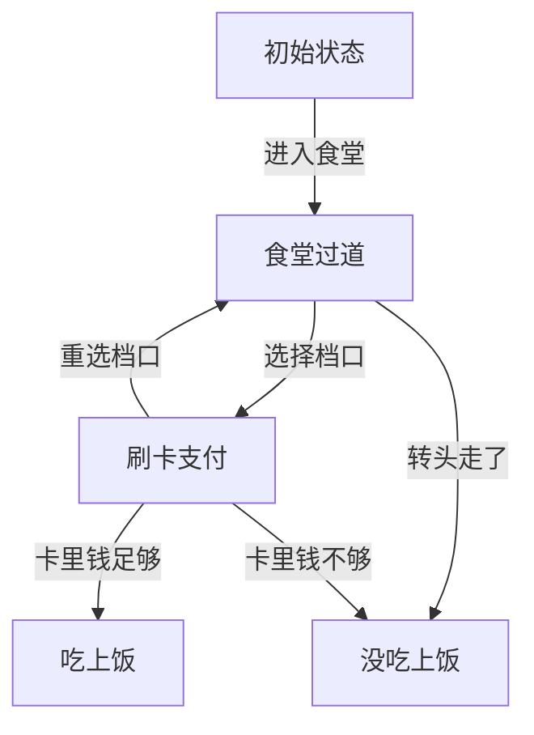
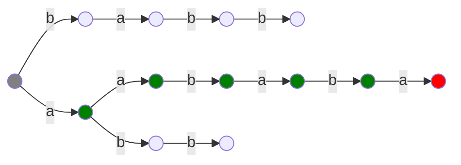
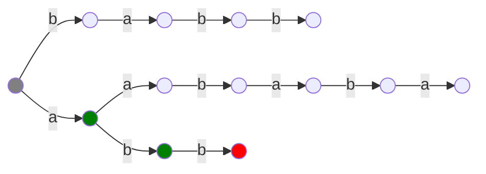
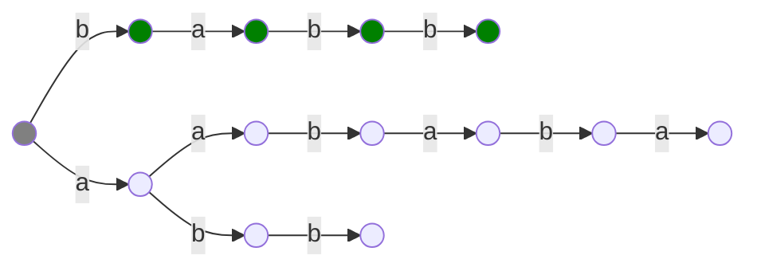
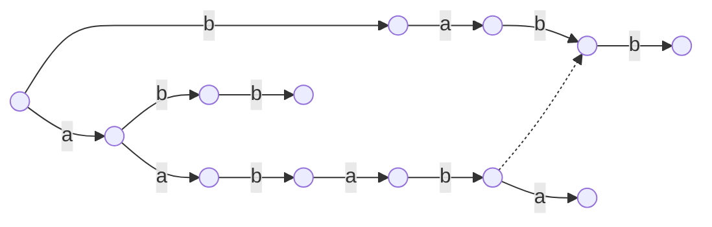
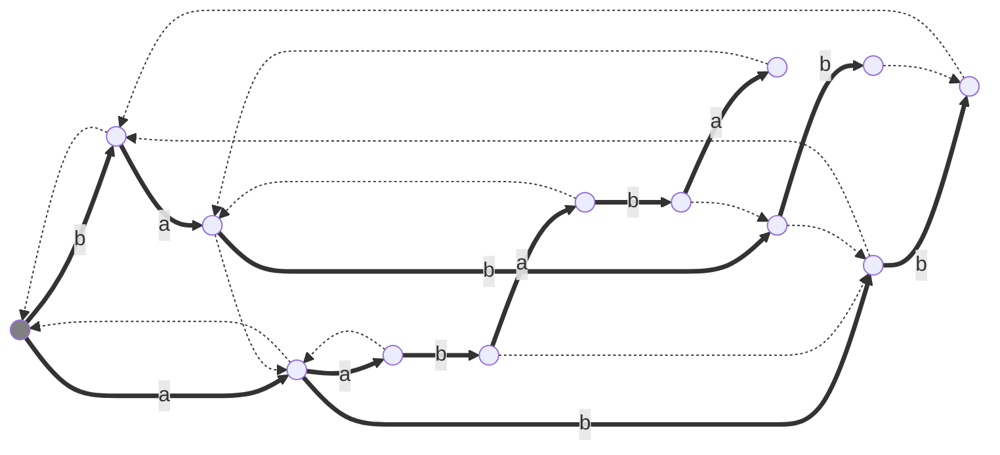

# AC 自动机

AC 自动机是一种用于多模匹配的高效算法。

## 自动机

自动机是一种判断一个**信号序列**是否满足**某种特定模式或规则**的数学模型。

“信号序列”是由有序排列的一组信号组成的，而“信号”可以是用户的一次操作，$1$ 到 $n$ 中的一个整数，一个小写字母等等。至于“某种特定模式或规则”，可以自己设定，比如：用户的操作能否成功买到商品，传入的字符串是不是另一个字符串的子串等。自动机可以判定给定的信号序列是否满足规则。

自动机的工作原理和流程图很像，我们可以把它看作一个**有向图**，每个节点是一种**状态**，而每条边是一种**转移**。我们需要一个函数 $f(S,c)$，表示当我们处在一个状态 $S$ ，传入信号 $c$ 时，应当转移到哪一个状态。没有传入任何信号时位于**初始状态**，传完信号后根据所在状态判断是否满足规则。

比如在一中食堂吃饭，食堂可以看作一个自动机：

当你传入信号序列“进入食堂-选择档口-重选档口-选择档口-卡里前足够”,那么这个信号序列可以吃上饭；如果传入信号序列“进入食堂-转头走了”，那么这个信号序列就没吃上饭。

在信息学中，自动机往往用在字符串方面，并且我们通常研究的是**确定性有限状态自动机（DFA）**，这样的自动机状态数量有限，并且转移函数 $f(S,c)$ 在 $S,c$ 一定时得到的值一定，即：你选择了进入食堂一定来到食堂过道，而不会既可能在过道，又可能回机房。

## AC 自动机

考虑长度为 $n$ 的文本串 $S$ 和若干长度之和为 $m$ 的模式串 $T_i$，AC 自动机可以对于 $S$ 的**每个前缀**求出**最长的后缀**满足其为**某个 $T$ 的前缀**。

我们可以将所有的 $T_i$ 插入一颗 Trie 树，对于 $S$ 的 $n$ 个位置都从根节点开始跳 Trie 树，往后匹配，直到在 Trie 树上跳不动为止。时间复杂度 $O(nm)$。如下，$S=\texttt{aababbba}$，$T=\{\texttt{aababa},\texttt{abb},\texttt{babb}\}$

$$
\def\ttt#1{\texttt{#1}}
\def\rttt#1{\textcolor{red}{\texttt{#1}}}
\def\gttt#1{\textcolor{green}{\texttt{#1}}}
\begin{aligned}
S:&\gttt{aabab}\rttt{b}\ttt{baa}\\
T:&\gttt{aabab}\rttt{a}
\end{aligned}
$$

$$
\begin{aligned}
S:&\ttt{a}\gttt{ab}\rttt{a}\ttt{bbbaa}\\
T:&\ \ \gttt{ab}\rttt{b}
\end{aligned}
$$

$$
\begin{aligned}
S:&\ttt{aa}\gttt{babb}\ttt{baa}\\
T:&\ \ \ \ \gttt{babb}
\end{aligned}
$$

这样的时间复杂度不可接受。考虑 KMP 的思想：我们定义 Trie 上的一个节点的 **$\text{fail}$ 指针** 为：从根到这个节点组成的字符串中的**最长后缀**满足其为**某个模式串 $T$ 的前缀**。如果匹配了 $S_{i\sim j}$ 但在 $S_{j+1}$ 处失配，我们从 $S_{i+1}$ 开始重新匹配就相当于检查 $S_{i+1\sim j}$ 这个后缀是不是某个 $T$ 的前缀，而 $\text{fail}$ 指针则简化了“检查后缀是否为 $T$ 前缀”的过程，我们在 Trie 树上直接跳 $\text{fail}$ 指针，看看跳完后有没有 $S_{j+1}$ 这个儿子可以匹配，如果没有就一直跳，直到可以匹配或者跳到 Trie 的根为止。

比如在第一次匹配中，已经成功匹配了（绿色部分）$\texttt{aabab}$，考虑 $\texttt{aabab}$ 的 $\text{fail}$ 指针指向 $\texttt{bab}$，如图。所以我们检查 $\texttt{bab}$ 有没有 $\ttt{b}$ 这个儿子，发现有，所以我们就成功匹配了 $S_{3\sim 6}=\ttt{babb}$。

发现：每次跳 $\text{fail}$ 指针检查有没有儿子 $S_{j+1}$ 还是太劣了。若节点 $u$ 没有儿子 $c$，我们可以直接令 $\text{son}(u,c)=\text{son}(\text{fail}(u),c)$。

如何构造 $\text{fail}$ 指针？我们设节点 $u$ 的 $\text{fail}$ 指针已找到，现在找 $\text{son}(u,c)$ 的 $\text{fail}$ 指针。易得：$\text{fail}(\text{son}(u,c))=\text{son}(\text{fail}(u),c)$。根据上一段对不存在的 $\text{son}$ 的定义，这是正确的。

如图：

