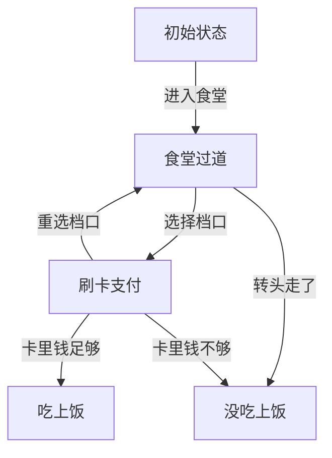
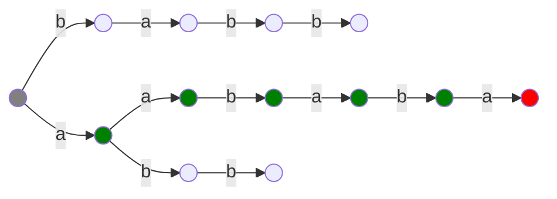
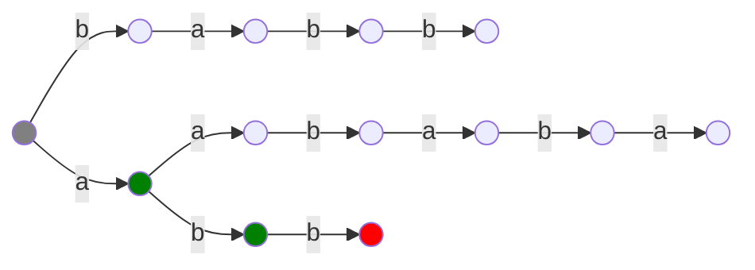
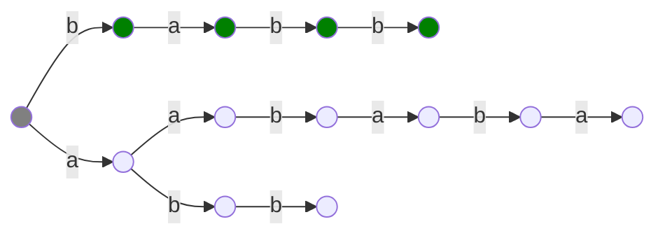
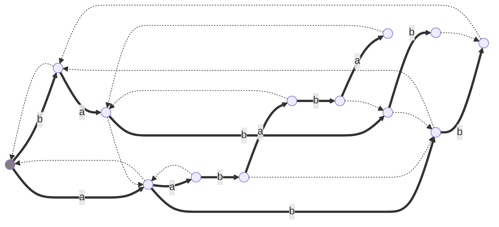

# AC 自动机

AC 自动机是一种用于多模匹配的高效算法。

## 自动机

自动机是一种判断一个**信号序列**是否满足**某种特定模式或规则**的数学模型。

“信号序列”是由有序排列的一组信号组成的，而“信号”可以是用户的一次操作，$1$ 到 $n$ 中的一个整数，一个小写字母等等。至于“某种特定模式或规则”，可以自己设定，比如：用户的操作能否成功买到商品，传入的字符串是不是另一个字符串的子串等。自动机可以判定给定的信号序列是否满足规则。

自动机的工作原理和流程图很像，我们可以把它看作一个**有向图**，每个节点是一种**状态**，而每条边是一种**转移**。我们需要一个函数 $f(S,c)$，表示当我们处在一个状态 $S$ ，传入信号 $c$ 时，应当转移到哪一个状态。没有传入任何信号时位于**初始状态**，传完信号后根据所在状态判断是否满足规则。

比如在一中食堂吃饭，食堂可以看作一个自动机：



当你传入信号序列“进入食堂-选择档口-重选档口-选择档口-卡里钱足够”,那么这个信号序列可以吃上饭；如果传入信号序列“进入食堂-转头走了”，那么这个信号序列就没吃上饭。

在信息学中，自动机往往用在字符串方面，并且我们通常研究的是**确定性有限状态自动机（DFA）**，这样的自动机状态数量有限，并且转移函数 $f(S,c)$ 在 $S,c$ 一定时得到的值一定，即：你选择了进入食堂一定来到食堂过道，而不会既可能在过道，又可能回机房。

## AC 自动机

考虑长度为 $n$ 的文本串 $S$ 和若干长度之和为 $m$ 的模式串 $T_i$，AC 自动机可以对于每一个 $T$ 判断其是否在 $S$ 中出现。

我们可以将所有的 $T_i$ 插入一颗 Trie 树，从 $S$ 的每个位置开始分别跳 Trie 树，往后匹配，直到在 Trie 树上跳不动为止。时间复杂度 $O(nm)$。如下，$S=\texttt{aababbba}$，$T=\{\texttt{aababa},\texttt{abb},\texttt{babb}\}$

（下文我们称一个字符串合法，意思是这个字符串是某个 $T$ 的前缀，即在 Trie 上。下文的后缀，无特殊说明均为真后缀，即不包括字符串本身）

<div class="grid" markdown>
<div>
$$
\def\ttt#1{\texttt{#1}}
\def\rttt#1{\textcolor{red}{\texttt{#1}}}
\def\gttt#1{\textcolor{green}{\texttt{#1}}}
\begin{aligned}
S:&\gttt{aabab}\rttt{b}\ttt{baa}\\
T:&\gttt{aabab}\rttt{a}
\end{aligned}
$$
</div>
<div>

</div>
</div>

<div class="grid" markdown>
<div>
$$
\begin{aligned}
S:&\ttt{a}\gttt{ab}\rttt{a}\ttt{bbbaa}\\
T:&\ \ \gttt{ab}\rttt{b}
\end{aligned}
$$
</div>
<div>

</div>
</div>

<div class="grid" markdown>
<div>
$$
\begin{aligned}
S:&\ttt{aa}\gttt{babb}\ttt{baa}\\
T:&\ \ \ \ \gttt{babb}
\end{aligned}
$$
</div>
<div>

</div>
</div>

这样的时间复杂度不可接受。$T$ 在 $S$ 中出现，说明 $S$ 有一个子串等于 $T$。而子串本身是不好做的，我们考虑**子串**可以转化成**所有前缀的所有后缀**，所以我们可以对于 $S$ 的每个前缀，求出其有多少个后缀是合法的。

记数改最优化，问题改为：对于 $S$ 的每个前缀，求出其最长的合法后缀。同时，我们需要对 Trie 树上的每个节点，求出其代表的字符串有多少的合法后缀。

为了同时解决这两个问题，参考另一个匹配算法 KMP 的思想，我们对 Trie 树上的每个节点 $u$ 定义一个**失配指针** $\def\fail{\text{fail}}\fail(u)$，其含义为 $u$ 代表的字符串的**最长合法后缀**。

失配指针是这样解决问题的：

1.  如果我们求出了 $S_{i}$ 的前缀的最长合法后缀，对应 Trie 上节点 $u$，如果 $u$ 有 $S_{i+1}$ 这个儿子，则 $S_{i+1}$ 这个前缀的最长合法后缀就是 $\def\son{\text{son}}、son(u,S_{i+1})$。否则，我们尝试把 $S_{i}$ 的最长合法后缀缩短一些，即 $u\leftarrow\fail(u)$，再检查 $\son(u,S_{i+1})$ 是否存在，直到 $u$ 为 Trie 根节点为止。

    比如在第一次匹配中，已经成功匹配了（绿色部分）$\texttt{aabab}$，考虑 $\texttt{aabab}$ 的 $\text{fail}$ 指针指向 $\texttt{bab}$，如图。所以我们检查 $\texttt{bab}$ 有没有 $\ttt{b}$ 这个儿子，发现有，所以我们就成功匹配了 $S_{3\sim 6}=\ttt{babb}$。

    ```mermaid
    graph LR
    0(( )) --> |b| b(( ))
    b --> |a| ba(( ))
    ba --> |b| bab(( ))
    bab --> |b| babb(( ))
    0 --> |a| a(( ))
    a --> |a| aa(( ))
    aa --> |b| aab(( ))
    aab --> |a| aaba(( ))
    aaba --> |b| aabab(( ))
    aabab --> |a| aababa(( ))
    a --> |b| ab(( ))
    ab --> |b| abb(( ))
    aabab -.-> |fail| bab
    linkStyle 4,5,6,7,8 stroke:green
    aabab -.-x |b| aababb(( ))
    linkStyle 13 stroke:red
    style aababb fill:red
    linkStyle 3 stroke:green
    style babb fill:green
    style 0 fill:grey
    ```

2.  现在找到了 $S_i$ 的最长合法前缀对应 Trie 上节点 $u$，那么从 $u$ 一直跳 $\fail$ 指针，就可以获得前缀 $S_i$ 的所有合法后缀了。

如何构造 $\fail$ 指针？

对于一个节点 $u$，假设 $\son(u,c)$ 不存在，那么我们在上文的操作中，我们会令 $u\leftarrow\fail(u)$ 再找 $\son(u,c)$。因此，我们可以直接令 $\son(u,c)=\son(\fail(u),c)$。

现在求 $\fail$ 指针。我们设节点 $u$ 的 $\fail$ 指针已找到，现在找 $\son(u,c)$ 的 $\fail$ 指针。易得：$\fail(\son(u,c))=\son(\fail(u),c)$。

由于 $\fail$ 指针永远是深度大的连深度小的，所以我们应在 Trie 上按 BFS 序求解。

按照上文的流程，我们成功构造了 AC 自动机，其转移函数为 $son(u,c)$，接受一个文本串并返回模式串的出现情况。如图是一个构造好 $\fail$ 指针的 AC 自动机：



现在我们就能通过洛谷上 AC 自动机的弱化版了。目前复杂度的一个缺陷是：我们在找 $S_i$ 前缀的所有合法后缀时跳 $\fail$ 指针的操作是开销很大的，最坏总复杂度会 $O(n^2|\Sigma|)$。解决方法也很简单：Trie 上的所有 $\fail$ 指针构成了一棵内向树，跳 $\fail$ 指针的操作相当于树上把从某个节点到根的路径上所有节点打一个标记。我们只需在 $S_i$ 前缀的最长合法后缀的对应节点 $u$ 处打一个标记，全部打完后一次 DFS/拓扑序就可以求出所有节点的标记数量了。

时间复杂度 $O(n|\Sigma|)$。